# Remind 2 Renew (Final Project)

## The App
This app allows users to add items to a tracker that they need to renew or be reminded about. When a user adds an item to their tracker, an item is created that sets an alert date that is chosen by the user and on the alert date an email will be sent to the user. The user can provide all information needed to make the renew process easier for them when the time comes.

#### Landing Page
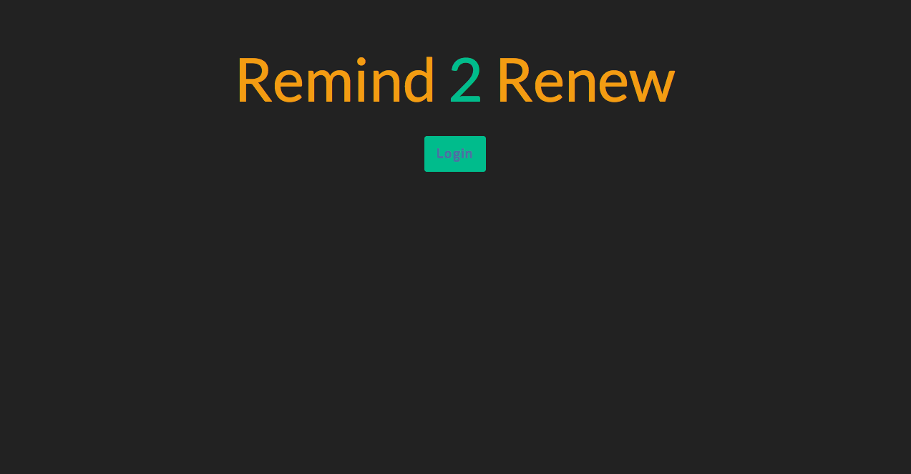

#### Home Page
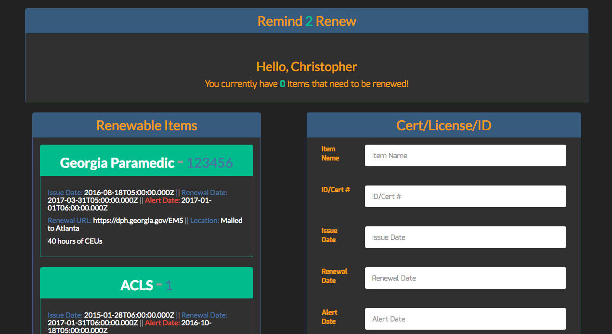

## Demo the App
[Remind 2 Renew](http://remind2renew.herokuapp.com/login)

## Technologies Used

- MERN Stack
  * MongoDB 
  * ExpressJS
  * React
  * NodeJS
- Agenda
- Nodemailer
- Nodemailer-SMTP-Transport
- Auth0
- Bootswatch
- Webpack

I used Express and Node to run our app. React was used to create our Single Page Application. React allowed us to make updates to our tracker, without refreshing the page.

I also used Node and Express to run the background process of sending the email. When the app gets fully functional the background process will be running every 12 hours to confirm alert dates.

Bootswatch & CSS were used to style the page.

## Approach Taken

Starting out I wasn't exactly sure what I wanted to build. I had a few ideas but worried the complexity in how I envisioned was going to be to much for a solo project. I spent the entire weekend brainstorming on what to do and finally at 11pm on Sunday I went with one of my original ideas. I then started putting the idea on a whiteboard and moving the features around to create my MVP. Once I had my features some what mapped out and potentially something I could build within the time constraints I had I started mapping the User stories. So coming in Monday morning I had a lot of the work already done as far as planning. 

#### User Stories
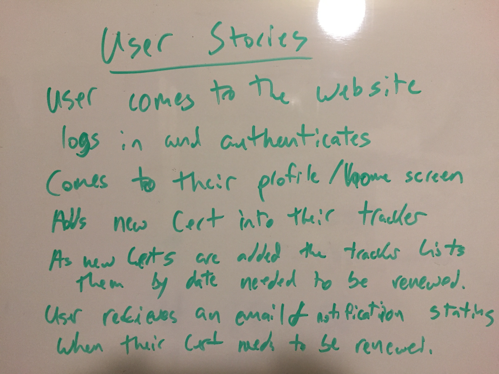

#### MVP
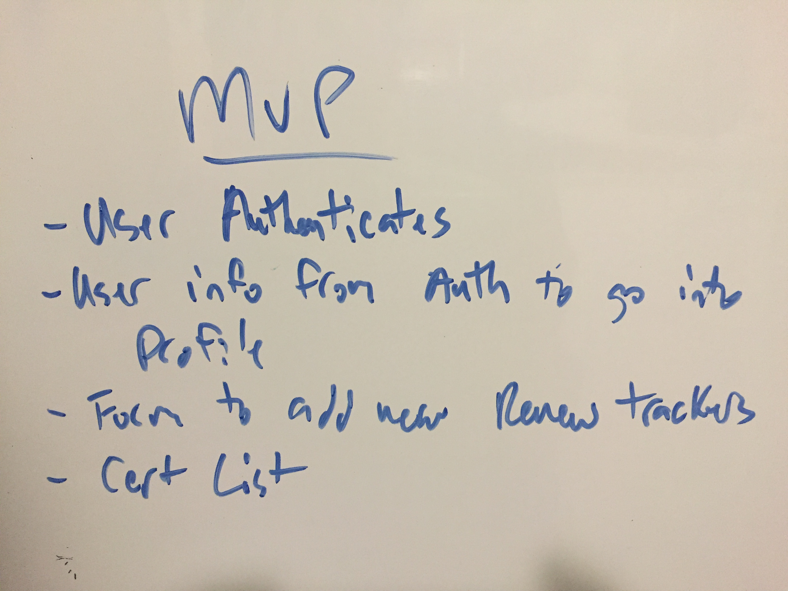

#### Bonus
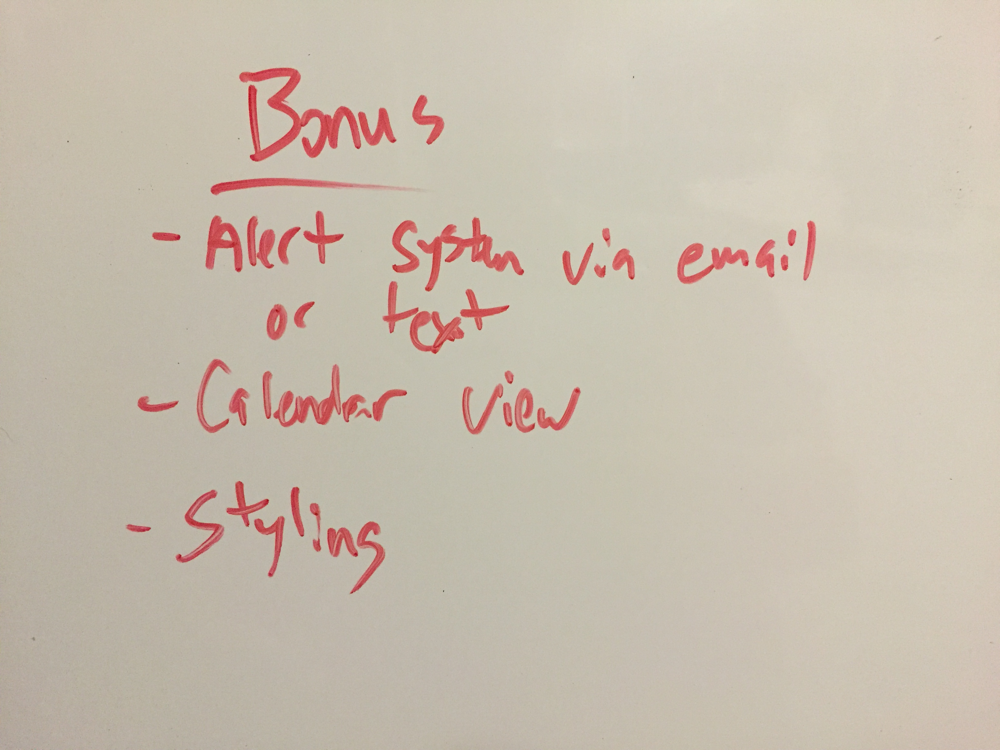

Monday morning I forked the template then removed Git and created my own repo. I then setup the Github repo so I could push all changes made. From there I went ahead and set up the User auth with Auth0 and got that functioning. I then moved into ERDs, wireframing, and setting up trello board to keep track of my progress.

#### ERD
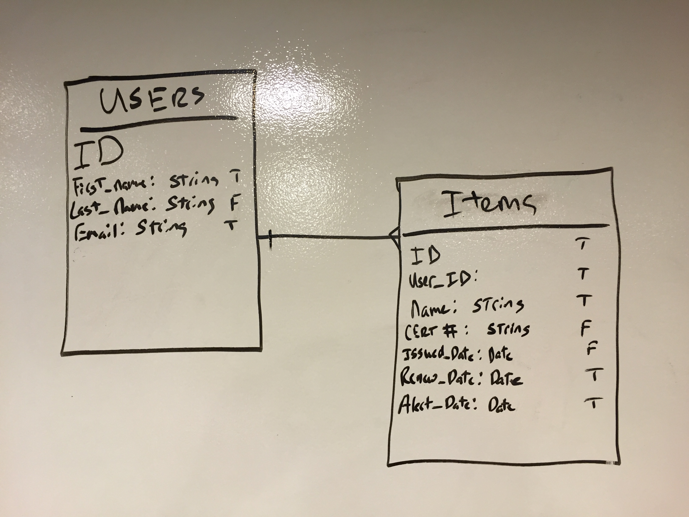

#### Wireframe
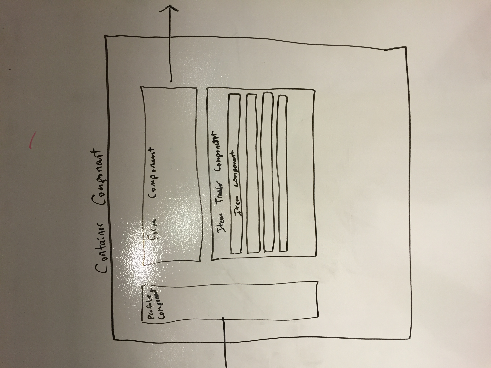

#### WF-Profile
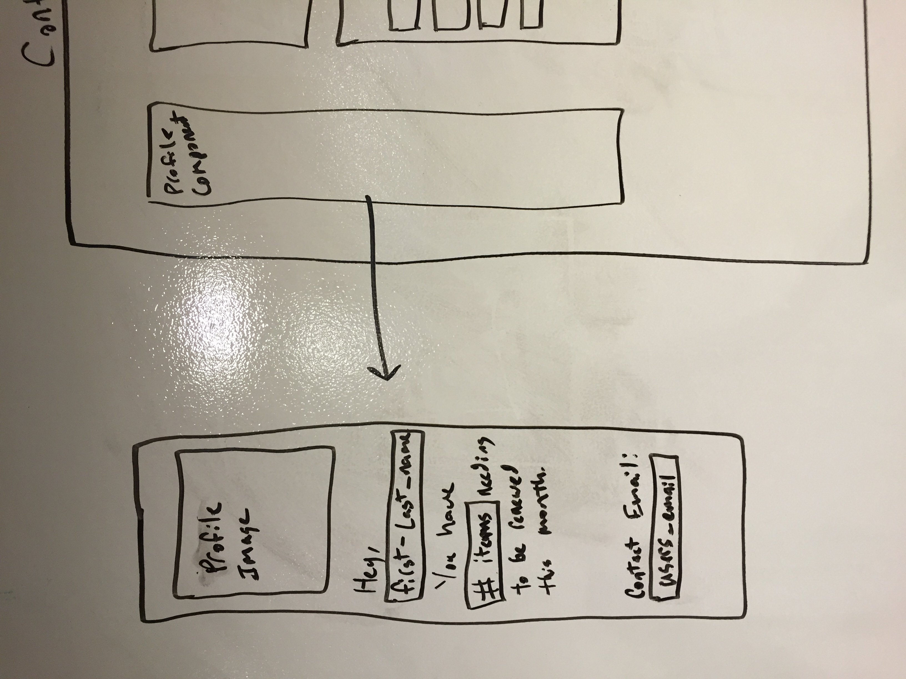

#### WF-Form
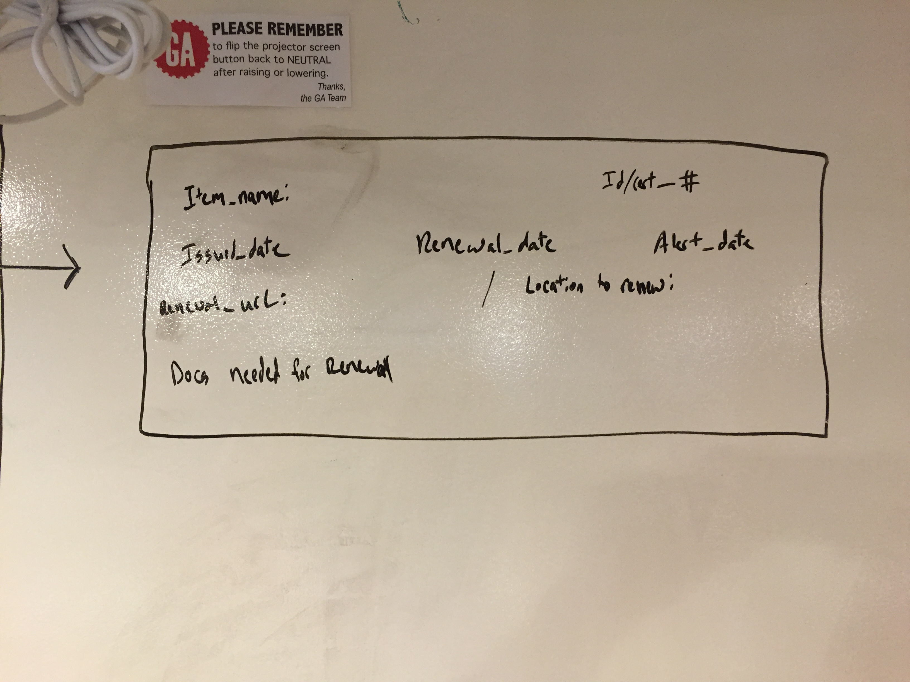

#### Trello Progress Board
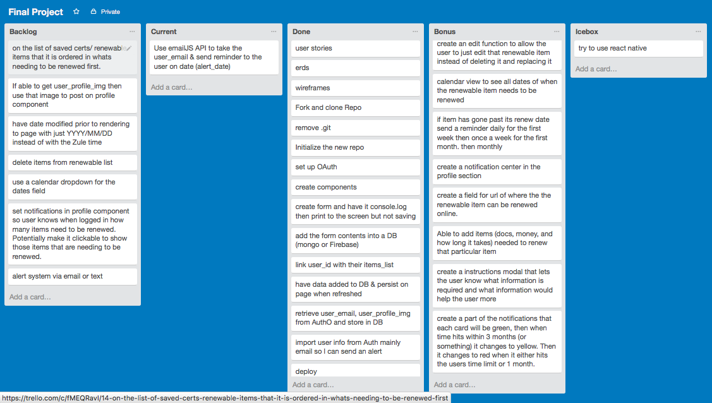

After having most of the non-coding work done I went ahead and started creating my components, models, and then coding a basic structure that could be rendered on the page. Then the process of taking the values passed into the form and rendering them in their component as well as in the database came next. Once I knew I had that functioning I knew I wanted to make sure that, that data was associated with that particular user so I made sure to link those two collections.

Once I had the react components for the form and tracker working how I wanted I then moved into the more complicated portion which was setting up a background process. The background process would be running in the backgorund and would be coded to check every 12 hours for any alert dates that would be set for the next 12 hours. From there it would get the user_id of that alert date and then get the email from the User collection to send an  email to the user to remind them of their item that needs to be renewed. This had to be broken down into multiple parts due to not having done this prior. I first made sure the background process was working correctly and then moved into setting up a Node email sending module. Once I had this I just set the background process to send a hardcoded email to know it works. After that I wanted to set the function up to check the alert dates and then retrieve that data needed to send the email. Once it has that and sends an email it would set a boolean to true that an email has been sent to that user so they wouldn't get an email every time the background process ran. I however wasn't able to get the last two parts functioning prior to the demo and will be worked on going forward.

## Unsolved Problems

The main problems that are still in the backlog are 
    1. Querying data from MongoDB and using that data to put into the email for the background process. Then setting the alert to true that a reminder has been sent. 
    2. Doing something similar with querying data but using it for the Profile component.
    3. Having a counter notification that shows how many items need to be renewed so a user knows when they sign in. 
    4. Save the tracker list to order of whats either being alerted first or what needs to be renewed first.
    5. Delete / Edit items from the tracker
    6. Finish styling.
    
    
## Bonus Features

  Some bonus features I'd like to eventually get to are:
    1. Setting each item to a color code so that it knows when that item is good (green) then when it hits your alert time (orange/yellow) and finally when it is passed the renew date (red)
    2. Add online function to be able to directly renew if able to online
    3. Calendar view so you can see all items on a calender and the dates.
    4. Using React Native to make it more mobile friendly and not just repsonsive.
 
#### Renewal Item Warning
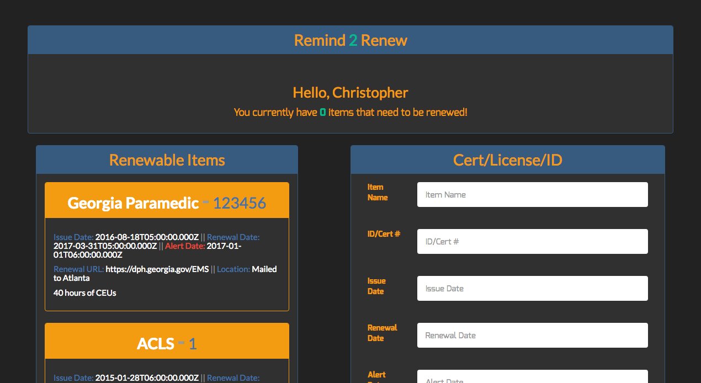

#### Renewal Item Danger


## Things I learned 

- Managing your time on a solo project. Up until this point we have been working in groups so time management was a bit different.
- Knowing your limits and timeframe to deliver an MVP.
- The use of Background processes with node and being able to run code while your app is running something completely different on the front end.
- the importance of Auth and being able to use the data already provided from a 3rd party source.
- Knowing I can get a basic React application up and functioning without much help. However when the level of complexity rises the use of instructors, mentors, friends, and peers helps a lot to push through the struggle points. 

## Installation

- Fork and/or clone the repository to your local machine
- Run npm install inside the directory to install all the dependecies used in this project.
- You'll need to create a file named `.env` in the directory and set the values like the following, so the app will work:

````bash
# .env file
AUTH0_CLIENT_SECRET=myCoolSecret
AUTH0_CLIENT_ID=myCoolClientId
AUTH0_DOMAIN=myCoolDomain
AUTH0_CALLBACK_URL=http://localhost:3000/callback
DB_CONNECT=myMongoConnectionString
````

- Once you've set those 5 environment variables, just run `nodemon` and try calling [http://localhost:3000/](http://localhost:3000/)
- You may also want to run `webpack --watch` simultaneously as you're running nodemon to help resolve potential issues
- You'll need to set the email you use and password for it as well. Then change the sent from email to your account.
- Once that is done you can run `node worker.js` and that will start the background process during the development cycle.
